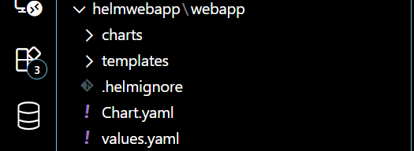
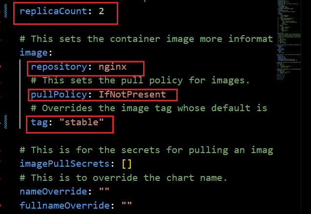
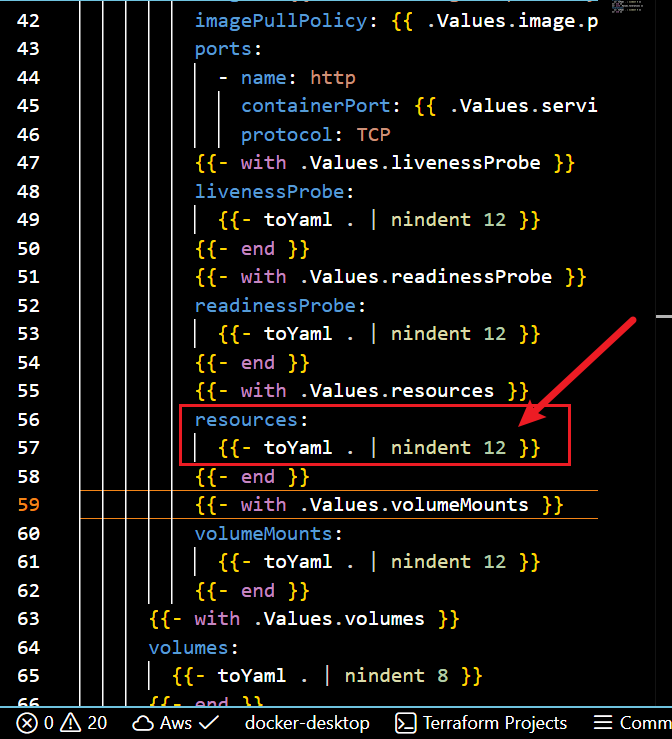
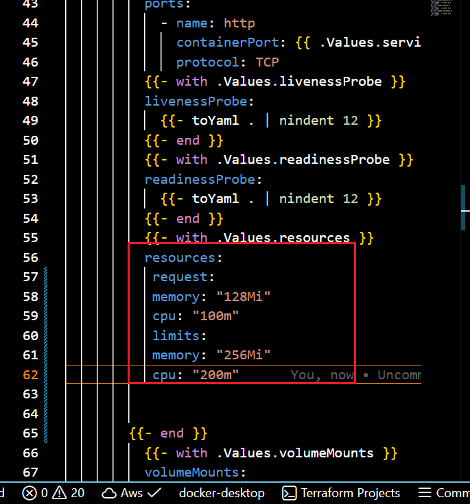
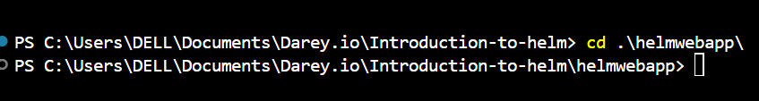
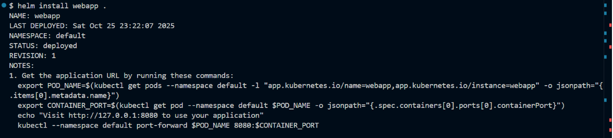
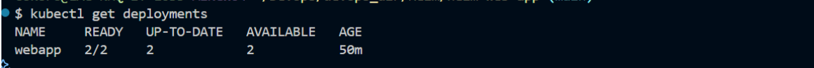
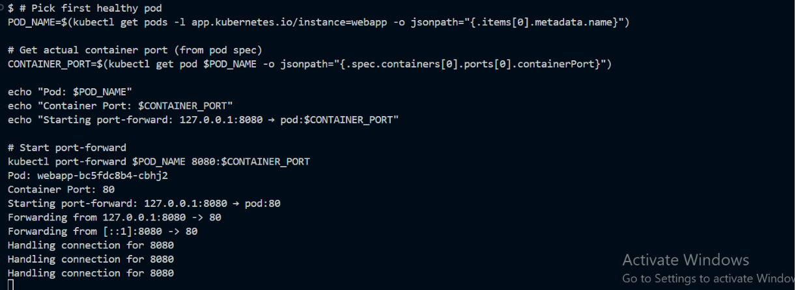
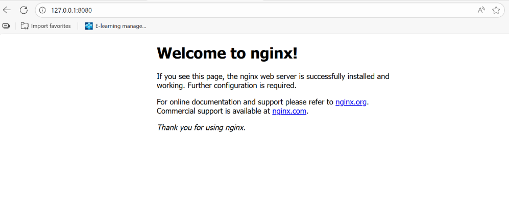

# working-with-helm-chart

## STEP 1: CUSTOMIZE HELM CHART
UNDERSTANDING HELM CHARTS, VALUES, AND TEMPLATES:

* CHART: It is a directory with predefined structure containing all the resource definitions needed to run an application, tool or service inside a kubernetes.
* VALUES: The `values.yaml`file inside a chart provides configuration values for a chart templates. 
* TEMPLATES: The ´template/´directory contains the template files. Thes are standard kubernetes YAML files with placeholder (`{{" .values.someparameters "}}`). 

1. EXPLORE THE "webapp" DIRECTORY

* Navigate to the "webapp" created by helm, inside you will find 
* "chart.yaml" : Contain metedata about the chart such as name, version , description.
* "values.yaml" : Provides configurable values that helm will inject into the templates. Here you set default configuration values. 
* templates: Contains the template files that will generate kubernetes manifest files. Thes templates reference the values defined in value.yaml

 

 2. MODIFY "values.yaml"

* Open "values.yaml" in a text editor
* Set the value to use the Nginx version

~~~~
replicaCount: 2

image:
  repository: nginx
  tag: stable
  pullPolicy: IfNotPresent
~~~~

* This configuration will deploy two replica of nginx server.
* Save your changes.

3. CUSTOMIZE "templates/deployment.yaml": 
   * Open the deployment.yaml file in the "template directory
   * Remove the line below from "spec.template.spec.containers.resources"

~~~~
{"{- toYaml .Values.resources | nindent 12 "}}
~~~~

* Add a simple resource request and limit under "spec.temples.spec.containers.resources" 

~~~~
resources:
  requests:
    memory: "128Mi"
    cpu: "100m"
  limits:
    memory: "256Mi"
    cpu: "200m"
~~~~

* This settings specifiy that your deployment should request "128Mi" of memory and "100m" cpu, but it wont use more than "256Mi" memory and "200m" cpu
* Save the file after making changes.

4. Commit and push changes

~~~~
 git add .
git commit -m "Customized Helm chart"
git push
~~~~

## STEP 2: DEPLOYING YOUR APPLICATION
1. DEPLOY WITH HELM: Navigate to the root directory "helm-web-app"

 Deploy the application on Kubernetes using the command below

~~~~
helm install my-webapp ./webapp
~~~~

1. Check deployment

~~~~
kubectl get deployments
~~~~

3. Visit application URL: Get the application URL by runnung the command below

~~~~
export POD_NAME=$(kubectl get pods --namespace default -l "app.kubernetes.io/name=webapp,app.kubernetes.io/instance=my-webapp" -o jsonpath="{".items[0].metadata.name"}")

export CONTAINER_PORT=$(kubectl get pod --namespace default $POD_NAME -o jsonpath="{".spec.containers[0].ports[0].containerPort"}")

kubectl --namespace default port-forward $POD_NAME 8081:$CONTAINER_PORT
~~~~

